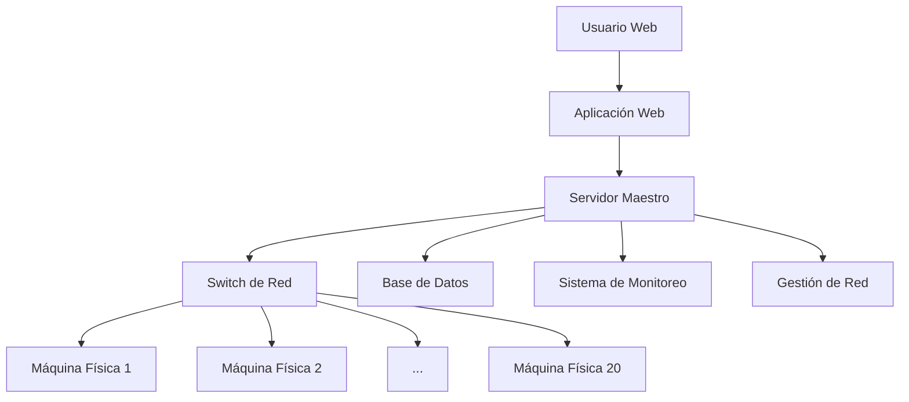

# CloudLab - Sistema de Gestión de Instancias Físicas

## 🎯 Visión General

CloudLab es un sistema de gestión de infraestructura que simula el comportamiento de Amazon EC2, pero utilizando máquinas físicas recicladas en lugar de virtualización. Los usuarios pueden aprovisionar, gestionar y monitorear instancias físicas a través de una interfaz web intuitiva.

## 🏗️ Arquitectura del Sistema



## 🎯 Objetivos del Proyecto

- **Educativo**: Aprender tecnologías de cloud computing y orquestación
- **Práctico**: Implementar un sistema funcional de gestión de infraestructura
- **Colaborativo**: Trabajar en equipo siguiendo metodologías ágiles
- **Innovador**: Crear una alternativa física a los servicios cloud tradicionales

## 📁 Estructura del Proyecto

```
CloudLab/
├── docs/                    # Documentación completa
├── webapp/                  # Aplicación web frontend
├── api/                     # Backend API REST
├── orchestrator/            # Sistema de orquestación
├── monitoring/              # Sistema de monitoreo
├── infrastructure/          # Scripts de configuración
└── tests/                   # Pruebas automatizadas
```

## 🚀 Enlaces Rápidos

- [📋 Requisitos del Sistema](https://criteriostudio.github.io/docs/Requisitos-Del-Sistema)
- [🏗️ Arquitectura Técnica](docs/Arquitectura-Tecnica)
- [📅 Fases del Proyecto](https://criteriostudio.github.io/docs/Fases-del-Proyecto)
- [✅ Criterios de Éxito](docs/Criterios-de-Exito)
- [⚙️ Guía de Configuración](docs/Guia-de-Configuracion)
- [👤 Manual de Usuario](docs/Manual-de-Usuario)

## 👥 Equipo de Desarrollo

| Rol | Responsable | Contacto |
|-----|-------------|----------|
| Project Manager | [Asignar] | [email] |
| Frontend Lead | [Asignar] | [email] |
| Backend Lead | [Asignar] | [email] |
| DevOps Lead | [Asignar] | [email] |
| QA Lead | [Asignar] | [email] |

## 📈 Estado del Proyecto

- **Fase Actual**: Planificación
- **Progreso**: 0%
- **Próximo Hito**: Configuración inicial del entorno

## 🤝 Contribución

1. Revisa los [requisitos del sistema](docs/Requisitos-del-Sistema.md)
2. Lee la [guía de configuración](docs/Guia-de-Configuracion.md)
3. Asigna una tarea en GitHub Projects
4. Crea una rama para tu feature
5. Envía un Pull Request

## 📞 Contacto

**Mentor del Proyecto**: [Nombre del mentor]
**Email**: [email@instituto.edu]

---
*Proyecto Final - Instituto Tecnológico | Curso 2024-2025*
