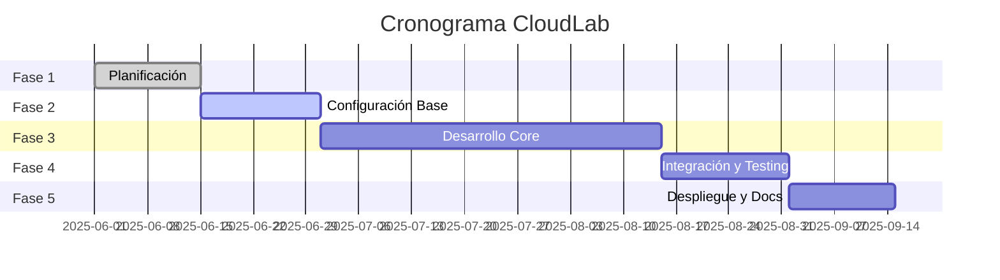

# Fases del Proyecto CloudLab

## 📊 Cronograma General

## 🗓️ Fase 1: Planificación y Diseño (2 semanas)

### Objetivos
- Definir arquitectura técnica detallada
- Establecer stack tecnológico
- Configurar herramientas de desarrollo
- Distribuir roles y responsabilidades

### Entregables
- [ ] Documento de arquitectura técnica
- [ ] Configuración de repositorio GitHub
- [ ] Setup inicial de herramientas de desarrollo
- [ ] Plan detallado de sprints
- [ ] Prototipo de interfaz (mockups)

### Criterios de Éxito
- ✅ Todos los documentos de diseño aprobados
- ✅ Entorno de desarrollo configurado para todo el equipo
- ✅ Primera reunión con mentor completada

## 🔧 Fase 2: Configuración de Infraestructura Base (2 semanas)

### Objetivos
- Configurar servidor maestro
- Preparar máquinas físicas
- Establecer conectividad de red
- Implementar sistema base de orquestación

### Entregables
- [ ] Servidor maestro operativo
- [ ] 20 máquinas físicas con OS base
- [ ] Red configurada y funcional
- [ ] Scripts básicos de aprovisionamiento
- [ ] Sistema de monitoreo básico

### Criterios de Éxito
- ✅ Conectividad SSH a todas las máquinas
- ✅ Servidor maestro accesible desde internet
- ✅ Sistema básico de inventario funcionando

## 💻 Fase 3: Desarrollo del Sistema Core (6 semanas)

### Sprint 1-2: Backend y API (2 semanas)
#### Objetivos
- Desarrollar API REST para gestión de instancias
- Implementar autenticación y autorización
- Crear base de datos y modelos

#### Entregables
- [ ] API REST funcional
- [ ] Sistema de autenticación
- [ ] Base de datos configurada
- [ ] Documentación de API

### Sprint 3-4: Frontend (2 semanas)
#### Objetivos
- Desarrollar interfaz web
- Implementar dashboard principal
- Crear formularios de gestión de instancias

#### Entregables
- [ ] Aplicación web responsive
- [ ] Dashboard con métricas
- [ ] Formularios de CRUD de instancias
- [ ] Integración con API

### Sprint 5-6: Orquestación y Monitoreo (2 semanas)
#### Objetivos
- Implementar sistema de orquestación completo
- Desarrollar sistema de monitoreo avanzado
- Integrar alertas y notificaciones

#### Entregables
- [ ] Orquestación automática de instancias
- [ ] Métricas en tiempo real
- [ ] Sistema de alertas
- [ ] Logs centralizados

## 🧪 Fase 4: Integración y Testing (2 semanas)

### Objetivos
- Pruebas de integración completas
- Testing de rendimiento y carga
- Corrección de bugs y optimizaciones
- Pruebas de usuario

### Entregables
- [ ] Suite de pruebas automatizadas
- [ ] Pruebas de carga completadas
- [ ] Bugs críticos resueltos
- [ ] Documentación de testing

### Criterios de Éxito
- ✅ Todas las pruebas automatizadas pasan
- ✅ Sistema soporta carga esperada
- ✅ No hay bugs críticos pendientes

## 🚀 Fase 5: Despliegue y Documentación Final (2 semanas)

### Objetivos
- Despliegue en producción
- Documentación completa de usuario
- Preparación de presentación final
- Transferencia de conocimiento

### Entregables
- [ ] Sistema desplegado en producción
- [ ] Manual de usuario completo
- [ ] Documentación técnica finalizada
- [ ] Presentación final preparada
- [ ] Video demo del sistema

### Criterios de Éxito
- ✅ Sistema accesible públicamente
- ✅ Documentación completa y clara
- ✅ Presentación exitosa del proyecto

## 📋 Ceremonias y Metodología

### Reuniones Regulares
- **Daily Standups**: Lunes, Miércoles, Viernes (15 min)
- **Sprint Planning**: Inicio de cada sprint (1 hora)
- **Sprint Review**: Final de cada sprint (1 hora)
- **Retrospectiva**: Final de cada sprint (30 min)
- **Reunión con Mentor**: Semanal (30 min)

### Herramientas de Seguimiento
- **GitHub Projects**: Kanban board principal
- **GitHub Issues**: Tracking de tareas y bugs
- **GitHub Discussions**: Decisiones técnicas
- **Slack/Discord**: Comunicación diaria

## ⚠️ Riesgos y Mitigaciones

| Riesgo | Probabilidad | Impacto | Mitigación |
|--------|--------------|---------|------------|
| Fallo de hardware | Media | Alto | Máquinas de respaldo, documentación de recovery |
| Retrasos en desarrollo | Alta | Medio | Buffer time, scope reduction si necesario |
| Problemas de red | Baja | Alto | Configuración redundante, plan B con VMs |
| Ausencias del equipo | Media | Medio | Documentación detallada, knowledge sharing |

---
*Documento actualizado: 2025-06-08*
